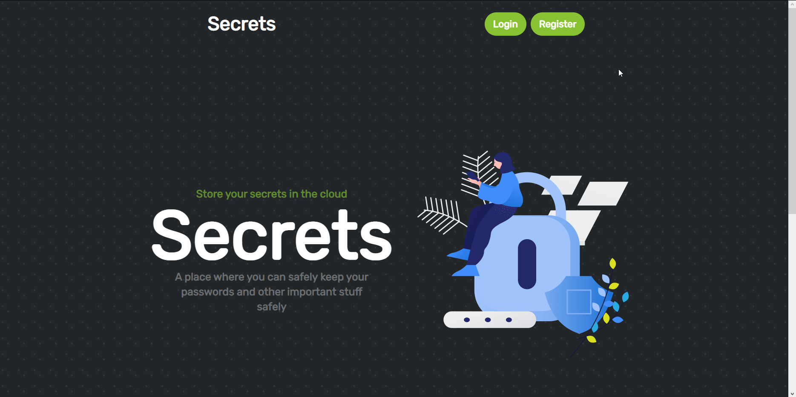

# Secrets
An application where one can secretly store their passwords and other sensitive information and access them from anywhere in the world.



## Setup 
It's quite a tedious process to setup the application. You need to have a few things installed on your system.
```
npm install -D tailwindcss
pip install -r requirements.txt
```

It comes with auto reload feature for html, css and js. So, you don't need to restart the server every time you make a change. Just save the file and the changes will be reflected in the browser.

Note - Looking for a good way to auto reload the browser too. If you know any, please let me know.

## Running the application
Open two terminals ( if for frontend development too , else just run `python main.py` ) and run the following commands in each of them.
```bash
bash build.sh
```
```bash
python main.py
```